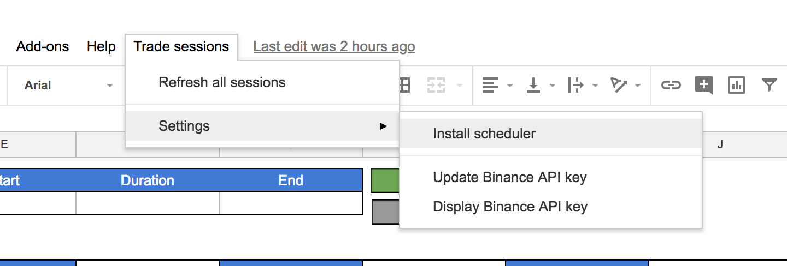
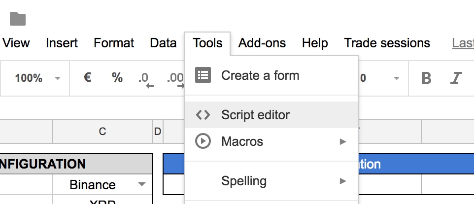
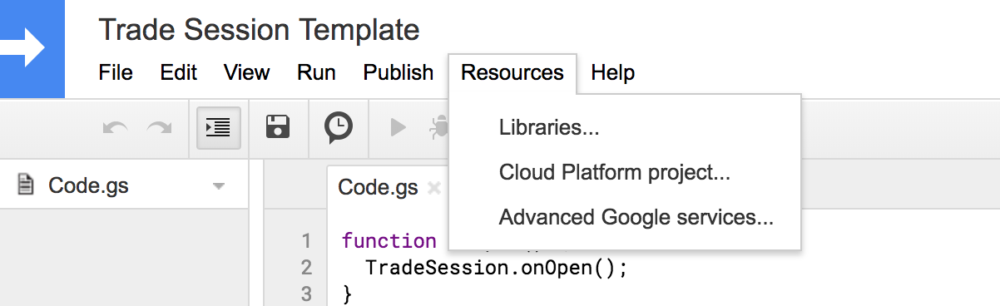

Trade session for Google Spreadsheet
====================================

Installation
------------

Duplicate this [Google Spreadsheet](https://docs.google.com/spreadsheets/d/1aXt26bV2RUjCR-XJO9AeHU_K6o8I3U83wLWw1l2-VOg)

You should see a new menu `Trade sessions` next to the `Help` menu.

Install the scheduler with `Trade sessions > Settings > Install scheduler`.

Upgrade
-------

To upgrade the library, go to `Tools > Script editor`

then `Resources > Libraries`

Here, you can select the last version of the library.
